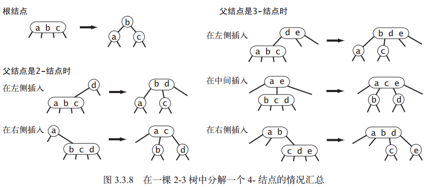
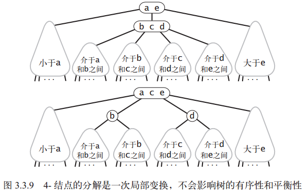
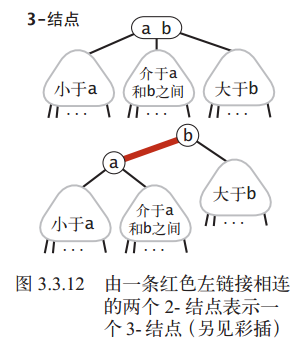
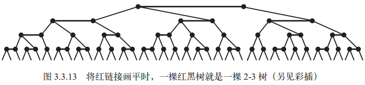

[TOC]

# 查找

## 2 二叉查找树

二叉查找树（BST）是一棵二叉树，每个结点的键都大于其左子树中的任意结点的键而小于右子树的任意结点的键

## 3 平衡查找树

二叉搜索树在最坏情况下性能还是很差，**平衡查找树**保证无论怎么构造，运行时间都是对数级别

一颗含N个节点的树，树高~lgN

放松完美平衡的要求

### 2-3查找树

为保证平衡性，增强灵活性：允许一个节点保存多个键

* 2-节点：一个键和两条连接
* 3-节点：两个键和三条链接

特点：一颗完美平衡2-3查找树，所有空连接到根节点的距离都应该相同

**查找**

把二叉查找树的查找算法一般化

**向2-节点插入新键**

如果**未命中**的查找在一个**2-节点结束**，直接保存，构成3-节点即可

**向只含一个3-节点的树中插入新键**

唯一的3-节点没有插入新键的空间，先临时存入，扩展成4-节点，含有3个键和4条链接

4-节点，很容易转换成一颗3个2节点组成的2-3树：根-中键、左子节点-最小键、右子节点-最大键

转换成的是一颗含有3个结点的二叉查找树，完美平衡的2-3树，插入前树的高度为0，插入后为1

**向一个父节点为2-节点的3-节点中插入新键 ▲**

未命中的查找结束于3-节点，其父节点为2-节点，需要**维持树的完美平衡的前提下为新键腾出空间**

构造临时4-节点并分解，但不为中键创建新节点，而实移至原父节点中

一次，父节点变成了3-节点

此**核心转换**不影响完美平衡，树仍然有序

**向一个父节点为3-节点的3-节点中插入新键**

构建3-节点
分解
中键插入到父节点
一直向上不断分解临时3-节点
直到遇到2-节点，替换成不需要分解的3-节点，或者是

**分解根节点**

如果向上分解都是3-节点，根节点会变成临时的4节点

按照向一棵只有一个 3- 结点的树中插入新键的方法处理这个问题：

将临时的4-结点分解为3个2-结点，使得树高加 1

仍然保证了完美平衡性

**局部变换**

将一个4-结点分解为一棵2-3树可能有 6 种情况：

2-3树插入算法的根本在于这些变换都是局部的：除了相关的结点和链接之外不必修改或者检查树的其他部分



**全局性质**

这些**局部变换**不会影响树的全局有序性和平衡性，任意空链接到根节点的路径长度都是相等的

只有根节点成为4-节点，分解为3个2-节点时，空连接到根节点的路径长度才会变



对于2-3树，我们关心**最坏情况下**的性能，任何**查找**或**插入**成本都不会超过对数界别

**难点**

实现比较耗时，需要额外开销，需要处理的情况太多，维护两种不同的节点

### 红黑二叉查找树

对2-3树的快捷实现

**替换2-3节点**

用标准的二叉查找树（全2-节点）和一些额外信息（替换3-节点）来表示2-3树

树中的链接分为两种：

1. 红链接：两个2-节点连起来构成一个3-节点
2. 黑链接：2-3树中的普通链接

3-节点表示为  一条左斜红链接相连的2个2-节点

优点：

* 无需修改，就可以直接使用标准二叉查找树的get()方法
* 对于任意2-3树，只要对节点进行转换，就可以立即派生出对应的二叉查找树

这样的方式表示出来的2-3树，就叫红黑**二叉查找树**



**一种等价定义**

红黑树的另一种定义，含有红黑链接并满足下列条件的二叉查找树：

* 红链接均为左链接
* 没有任何一个节点同时和两条红链接相连
* 完美黑色平衡，即任意空链接到根节点的路径上的黑链接数量相同

满足这样定义的红黑树和2-3树是一一对应的

**一一对应**

将红黑树的红链接画平，则所有的空链接到根节点的距离都相同

将由红链接相连的结点合并，得到的就是一棵 2-3 树



只要在这样的结构上实现2-3树的插入算法，就结合了二叉查找树的高效查找方法和2-3树的平衡插入算法

**颜色表示**

color记录节点的父节点指向它的链接是否为红色（约定空链接为黑色）

```c++
bool RED    = true;
bool BLACK  = false;

class Node {
    Key key;            // 键
    Value val;          // 关联值
    Node *left, right;  // 左右子树
    int N;              // 这颗子树中的节点总数
    bool color;         // 由其父节点指向它的链接的颜色

    Node(Key key, Value val, int N, bool color) {
        this.key    = key;
        this.val    = val;
        this.N      = N;
        this.color  = color;
    }
    bool isRed(Node x) {
        if (x = nullptr) return false;
        return x.color == RED;
    }
}
```

**旋转**

操作过程中可能会出现**红色右链接**或**两条连续的红链接**，但完成前要旋转修复

### 红黑树的性质

所有基于红黑树的符号表实现都能保证操作的运行时间为对数级别（范围查找除外，额外时间和返回的键的数量成正比）

